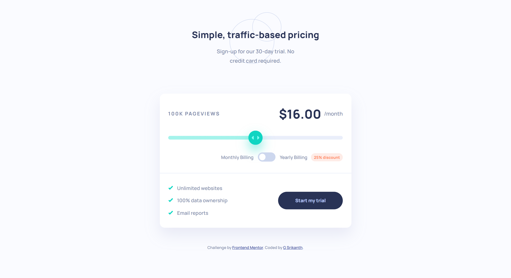
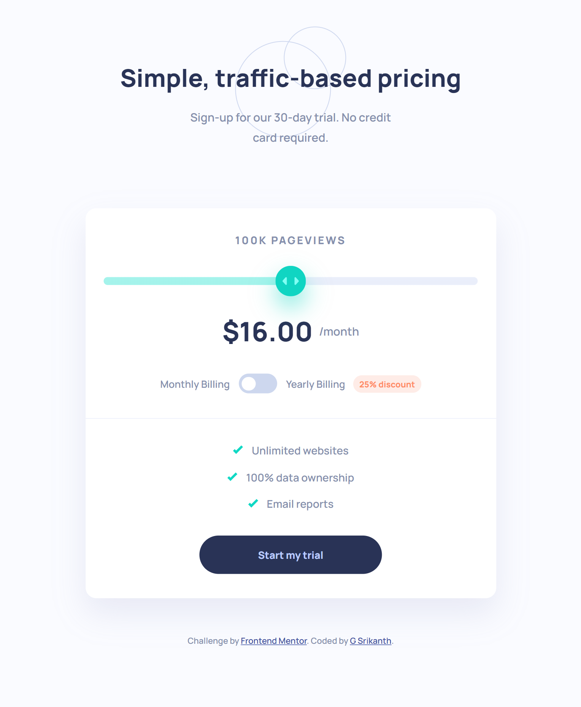

# Frontend Mentor - Interactive pricing component solution

This is a solution to the [Interactive pricing component challenge on Frontend Mentor](https://www.frontendmentor.io/challenges/interactive-pricing-component-t0m8PIyY8). Frontend Mentor challenges help you improve your coding skills by building realistic projects. 

## Table of contents

- [Overview](#overview)
  - [The challenge](#the-challenge)
  - [Screenshot](#screenshot)
  - [Links](#links)
- [My process](#my-process)
  - [Built with](#built-with)
  - [What I learned](#what-i-learned)
- [Author](#author)


## Overview

- This project is a solution to the Interactive Pricing Component challenge from Frontend Mentor. The goal of this challenge was to build a fully responsive pricing component with an interactive slider and billing toggle functionality. 

- Users can adjust the sliders to view different pageview plans and pricing totals. They can also switch between monthly and yearly billing, where yearly billing applies a 25% discount.

- The project focuses on responsive layouts, clean UI structure, custom range slider styling, and Jvascript interactivity.

### The challenge

Users should be able to:

- View the optimal layout for the app depending on their device's screen size
- See hover states for all interactive elements on the page
- Use the slider and toggle to see prices for different page view numbers

Page view and pricing totals

- 10K pageviews / $8 per month
- 50K pageviews / $12 per month
- 100K pageviews / $16 per month
- 500k pageviews / $24 per month
- 1M pageviews / $36 per month

If the visitor switches to yearly billing,a 25% discount is applied to all prices.

### Screenshot




### Links

- Solution URL: [solution URL]()
- Live Site URL: [live site]()

## My process

I started by structuring the layout using semantic HTML before moving into styling the sections one by one.

The project was built using a mobile first workflow. Afer creating the base layout, I implemented:

- Responsive card layout
- Custom range  slider styling
- Dynamic pricing updates using Javascript
- Slider progress fill effect
- Mobile and desktop responsive layouts

### Built with

- Semantic HTML5 markup
- CSS custom properties
- Flexbox
- CSS Grid
- Mobile-first workflow
- JavaScript

### What I learned

While building this project, I improved my understanding of:

- Structuring responsive layputs with cssGrid and Flexbox
- Creating custom styled range sliders
- Using Javascript to dynamically update UI content
- Handling responsive layout changes cleanly
- Styling custom toggle switches
- Managinglayout restructuring for mobile and desktop views

One thing I learned was how useful `grid-template-areas` can be for controlling layout positioning across breakpoints.

```css
.card-top {
  display: grid;

  grid-template-areas:
  "views price"
  "slider slider"
  "billing billing";
}
```

## Author

- Frontend Mentor - [@shrikanth-dev](https://www.frontendmentor.io/profile/yourusername)
- LinkedIn - [@G Srikanth](https://www.linkedin.com/in/g-srikanth-gs)


